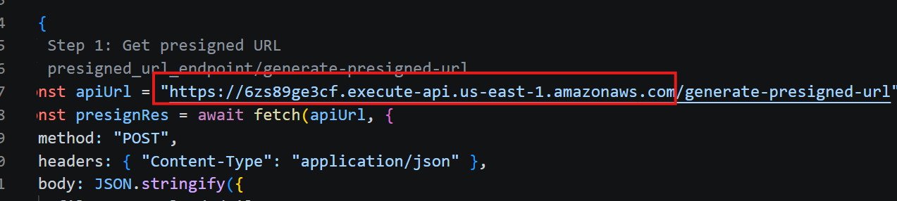
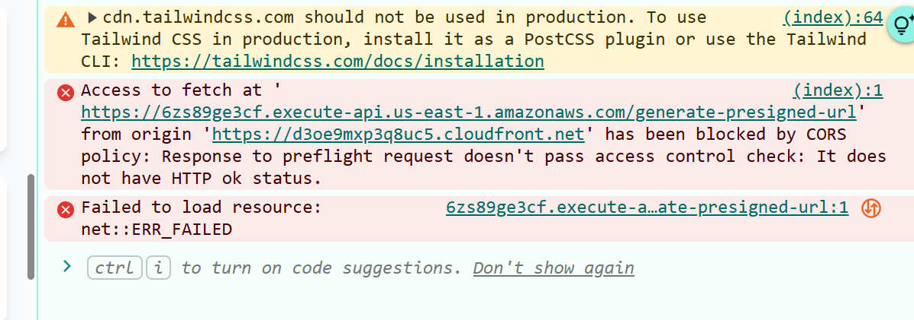
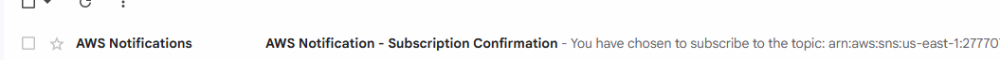
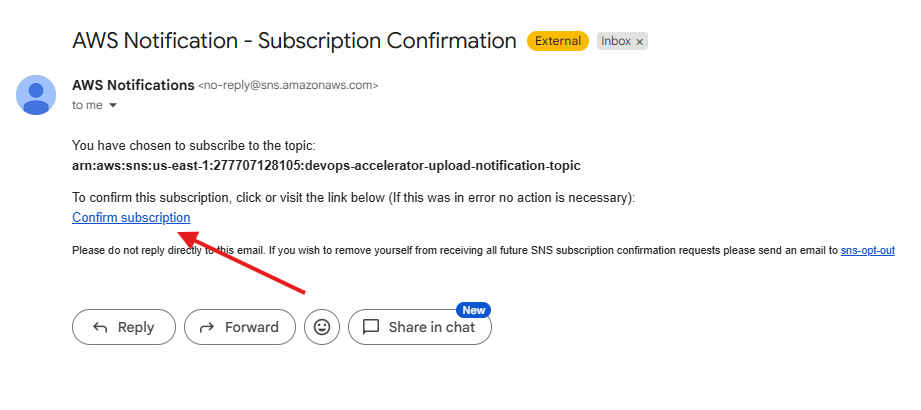
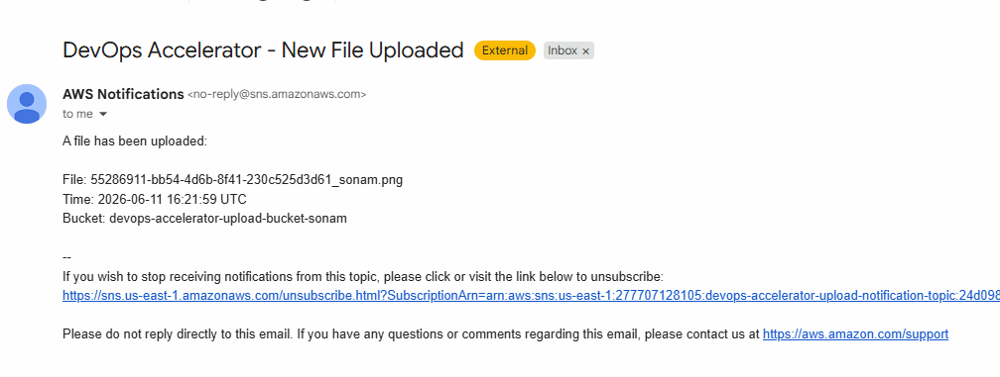

# Project Implementation

- clone my Repository: [Repository Link](https://github.com/sonam-niit/Devops-Capstone-Oct-2025.git)
- or else you can manually create folder named frontend
    - under that create index.html
    - copy code shown here
- create folder for infra   
    - create terraform
        - main.tf
        - variables.tf
        - outputs.tf
        - terraform.tfvars
- create folder for CICD
    - .github
        - workflows
            - terraform.yml
            - frontend.yml
            - backend-deploy.yml
- create folder for Backend
    - create folder generate-presigned-url
        - main.py (add code)
    - create folder process-uploaded-file
        - main.py (add code)


## Make sure AWS is Configured in  yor system

- verify

```bash
aws configure list
aws sts get-caller-identity
```
- if you don't have any of this 
- download aws cli in your system
- install verify using: aws --version

- next step is go to AWS Console Create IAM user with policy administrator Access
- click on create Access Key.
- you can see Access Key and Secret Key
- go to your system and run: aws configure
- enter access key then secret key and then region: us-east-1, format: json
- after this It will be configured.

## For Project we need 3 Buckets

1. S3 Remote Backend (create manually)
2. frontend Hosting (create using terraform)
3. Backend uploading files (create using terraform)

## Let's create bucket for Remote Backend and DynamoDb for Locking table

```bash
# Create S3 bucket for Terraform state
aws s3api create-bucket \
  --bucket devops-accelerator-platform-tf-state-sonam \
  --region us-east-1

# Create DynamoDB table for state locking
aws dynamodb create-table \
  --table-name devops-accelerator-tf-locker \
  --attribute-definitions AttributeName=LockID,AttributeType=S \
  --key-schema AttributeName=LockID,KeyType=HASH \
  --billing-mode PAY_PER_REQUEST \
  --region us-east-1
```

## Just For Frontend Deployment

- only manage infra code for frontend
- create only terraform.yml workflow
- make sure you add all required secrets inside repository
- then make a push only infra and workflow
- check output resource created.

## Temporary Check

- try to upload index.html manually to S3 bucket
- check Couldfront DNS in browser you can see deployed Page


## Create Backend files as shown 

## Create zip for Lambda

```bash
cd backend/process-uploaded-file
zip -r lambda.zip .

cd ../generate-presigned-url
zip -r lambda.zip .
```

- Update Terraform code
- Also create backend.yml for workflow
- now just push backend, infra and workflow folders

- Now you can see in Output of your workflow
- presigned URL that you need to copy and update index.html



- now create frontend.yml
- push your frontend and .github files
- now you can see workflow executed for frontend
- you can see index.html got sync with s3 bucket and its updated.

- Now try to submit form but still it showing some CORS Erros.



## Resolve CORS Error

- Go to Backend S3 Bucket
- Permission -> CORS -> Edit

```json
[
    {
        "AllowedHeaders": [
            "*"
        ],
        "AllowedMethods": [
            "PUT",
            "POST",
            "DELETE",
            "GET",
            "HEAD"
        ],
        "AllowedOrigins": [
            "*"
        ],
        "ExposeHeaders": []
    }
]
```

- save (check again)
- if still showing the same error
- means Image is not uploaded via lambda to S3 Bucket
- for Upload we created Lambda , which triggers API
- Open API - from AWS
- selet presigned api -> select that POST method
- left side below you can see protect -> throttling
- edit -> select default -> 
- bust limit: 100 (sudden spike)
- rate limit: 200 (normal flow 200 req per second)
- save and try to upload again

## To Receive Email

- when SNS topic generated you will get one email for scription
- that you need to confirm to receive an email

- check your email





- now you can try to submit screenshot again on cloudfront URL and you will receive an email



- Once Uploaded Successfully
- check email, cloudwatch Logs by clicking on Log Management, check s3 bucket uploads